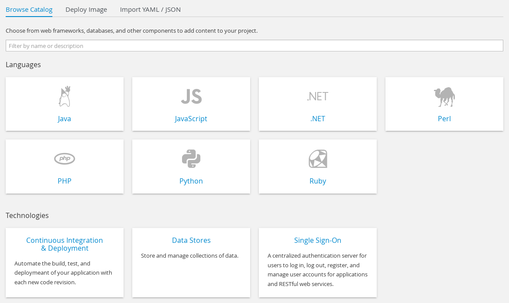
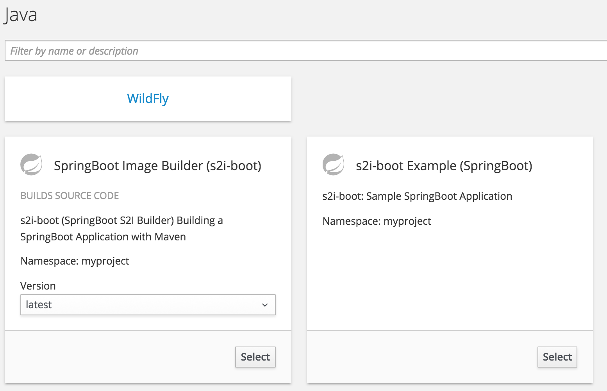
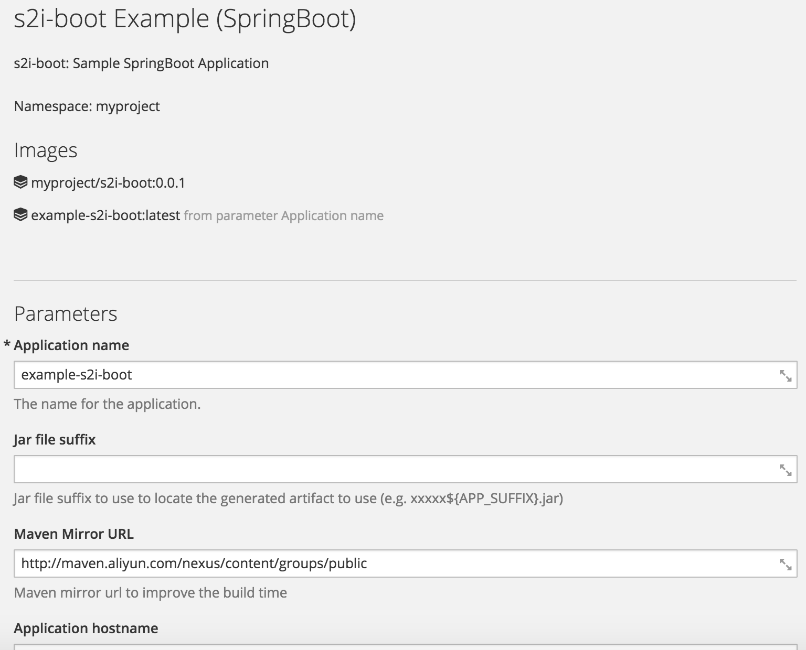
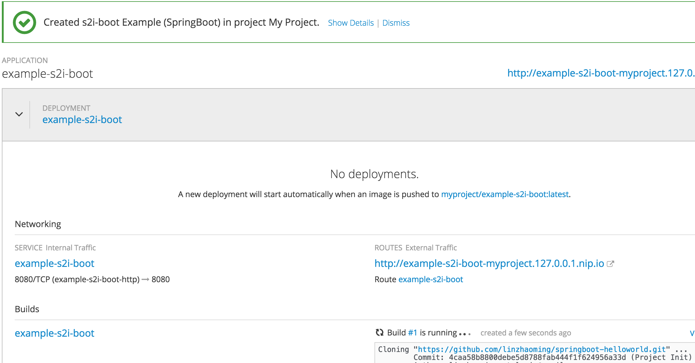

# QuickStart

## Importing the s2i-boot Builder

- Importing the s2i-boot builder

  ```
  $ oc create -f https://raw.githubusercontent.com/linzhaoming/s2i-boot/master/openshift/s2i-boot-imagestream.yml

  imagestream "s2i-boot" created
  ```

- Importing the template example

  ```
  $ oc create -f https://raw.githubusercontent.com/linzhaoming/s2i-boot/master/openshift/example-s2i-boot.yml

  template "example-s2i-boot" created
  ```

  ​

## Creating from **s2i-boot** Templates Using the Web Console

To create the objects from an uploaded template using the web console:

1. While in the desired project, click Add to Project:


2. Select a template from the list of templates in your project, or provided by the global template library:

Select **Java** Template



Select **s2i-boot Example(SpringBoot)**



3. Modify template parameters in the template creation screen if needed:



Click  the  **Create** Button 
4. You should see the result like this



## Creating from Templates Using the CLI

- Using the CLI to deploy the new app

```
$ oc new-app example-s2i-boot
--> Deploying template "myproject/example-s2i-boot" to project myproject

     s2i-boot Example (SpringBoot)
     ---------
     s2i-boot: Sample SpringBoot Application

     * With parameters:
        * Application name=example-s2i-boot
        * Jar file suffix=
        * Maven Mirror URL=http://maven.aliyun.com/nexus/content/groups/public
        * Application hostname=
        * GIT_URI=https://github.com/linzhaoming/springboot-helloworld.git
        * GIT_REF=master
        * CONTEXT_DIR=
        * APP_OPTIONS=
        * GITHUB_TRIGGER_SECRET=54uB6vkL # generated
        * GENERIC_TRIGGER_SECRET=t8TTWiqG # generated

--> Creating resources ...
    buildconfig "example-s2i-boot" created
    imagestream "example-s2i-boot" created
    deploymentconfig "example-s2i-boot" created
    route "example-s2i-boot" created
    service "example-s2i-boot" created
--> Success
    Build scheduled, use 'oc logs -f bc/springboot-helloworld' to track its progress.
    Access your application via route 'example-s2i-boot-myproject.127.0.0.1.nip.io' 
    Run 'oc status' to view your app.
```

